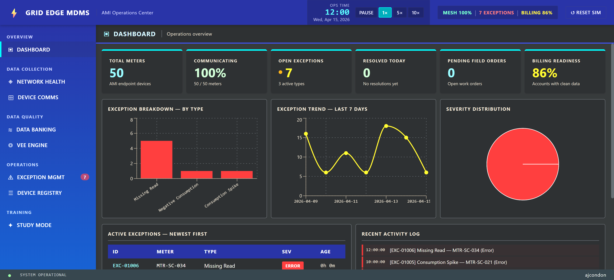
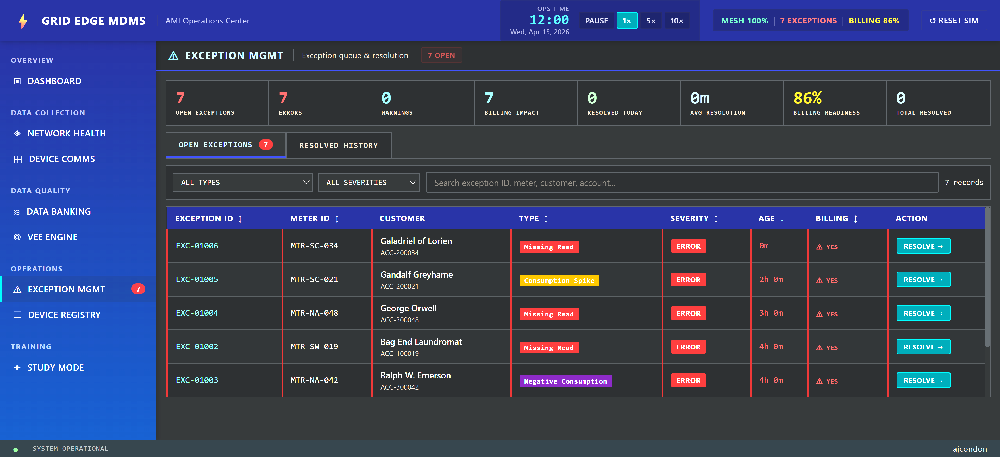

<div align="center">

# AMI Analyst Workstation

**A fully interactive simulation of the systems an Advanced Metering Infrastructure (AMI) Exception Analyst works with daily.**  
Built as an educational tool for learning utility AMI operations.


</div>

---

## 📸 Screenshots

<div align="center">





</div>

---

## 🏗️ What This Simulates

Real AMI analysts work across multiple interconnected systems: they monitor RF mesh networks, manage meter communication failures, run VEE pipelines, resolve billing exceptions, and coordinate field service responses — all under billing cycle deadlines.

This app replicates that entire workflow in a self-contained frontend simulation:

```
  Smart Meters (×49)
        │  RF Signal
        ▼
  Collector Nodes / DCUs (×5)
        │  WAN
        ▼
  Head-End System (HES) ──────► Event Log
        │
        ▼
  MDMS  (96 intervals · meter · day)
        │
        ▼
  VEE Pipeline ────────────────► 7 Validation Rules
        │                               │
        ▼                               ▼
   Clean Data                    Exception Queue
        │                               │
        ▼                        Resolution Workflow
   Billing ◄──────────────────── (Retry · Estimate · Dispatch)
```

| Module | What It Does |
|---|---|
| **Daily Dashboard** | Live summary cards, exception trend charts, severity breakdown, activity log |
| **RF Mesh Network** | SVG map of 49 smart meters and 5 collector nodes across 3 neighborhoods; real-time signal animation |
| **AMI Head-End System** | Meter communication table with on-demand reads, event log, sortable/filterable columns |
| **MDMS** | 96-interval (15-min) area chart per meter, register read log, VEE pipeline status |
| **VEE Engine** | 7 validation rules (missing intervals, spike check, sum check, etc.) with pass/fail per meter; batch run; estimation methods |
| **Exception Queue** | Full resolution workflow: review data → select action → analyst note → audit trail |
| **CIS** | Customer account lookup, 12-month billing history, service timeline, field order creation |
| **Study Mode** | Exception type guide (all 8 types), AMI glossary (26 terms), scored quiz with 6 scenarios |

---

## ⚡ Exception Types Simulated

All 8 exception types an AMI analyst encounters in production:

| Exception Type | Description |
|---|---|
| **Missing Read** | Intervals not received within the collection window |
| **Consumption Spike** | Usage 3–10× above historical profile |
| **Zero Read on Active Account** | All intervals zero, non-solar account |
| **Negative Consumption** | Negative intervals on a non-net-metering account |
| **Stale Data** | Register unchanged across 3+ read cycles |
| **Communication Failure** | Meter unreachable at HES |
| **Tamper Alert** | Enclosure open / magnetic bypass event |
| **CT Ratio Mismatch** | Programmed vs. field-detected ratio mismatch (commercial meters) |

---

## ⚙️ Simulation Engine

A background timer drives the simulation — **15 seconds real-time = 1 sim-hour × speed multiplier**.

> [!NOTE]
> The simulation runs entirely in the browser. No data leaves the page — all meter state, exceptions, and audit history are generated and stored locally.

| Behavior | Detail |
|---|---|
| Missing read rate | 1–3% of meters per cycle |
| Stochastic events | Spikes, zero reads, stale data, tamper alerts fire randomly |
| Cascading failures | Collectors can go offline, failing all downstream meters |
| RF signal drift | Continuous random walk per meter |
| Exception ingestion | New exceptions enter the queue automatically |
| Speed controls | Pause · 1× · 5× · 10× |
| Persistence | Full `localStorage` — sim state survives page refresh |

---

## 🗄️ Data Model

> [!IMPORTANT]
> All data is 100% client-side generated. There is no real meter data, no real customer PII, and no external API calls.

| Entity | Detail |
|---|---|
| **Meters** | 49 meters across 3 neighborhoods: Springfield-West, Springfield-Central, Northampton |
| **Collectors** | 5 DCUs with mesh health tracking |
| **Rate classes** | Residential · Commercial (with CT ratios) · Solar (net metering) |
| **Load profiles** | Residential duck curve · Commercial flat-peak · Solar negative export 9am–4pm |
| **Seeded attributes** | Customer names, account numbers, addresses, firmware versions, install dates |

---

## 🚀 How To Run

```bash
# Install dependencies
npm install

# Start development server
npm run dev
# → http://localhost:5173

# Production build
npm run build

# Preview production build
npm run preview
```

> [!TIP]
> No backend, no API keys, no environment variables required. Fully self-contained client-side app. Node.js 18+ recommended.

---

## 🛠️ Tech Stack

| Layer | Technology | Notes |
|---|---|---|
| **Framework** | React 19 + Vite 8 | Component-based UI, HMR dev server |
| **Charts** | Recharts | 96-interval area charts, trend lines |
| **Styling** | Custom CSS (no UI framework) | JetBrains Mono + IBM Plex Sans |
| **Persistence** | `localStorage` | No database — full sim state serialized client-side |
| **Data** | 100% client-side generated | Seeded fake data, deterministic profiles |

---

## 🎨 Aesthetic

Industrial utility operations center aesthetic — dense, data-rich, professional ops tool feel (not a consumer app).

| Token | Value | Usage |
|---|---|---|
| Background | `#0d1117` | Near-black base |
| Warning / Amber | `#f59e0b` | Active exceptions, alerts |
| Healthy / Green | `#22c55e` | Good meter status, passing VEE |
| Error / Red | `#ef4444` | Failures, tamper, comm loss |
| Info / Blue | `#3b82f6` | Informational badges |
| Data font | **JetBrains Mono** | All IDs, readings, interval values |
| UI font | **IBM Plex Sans** | Labels, headings, nav |

Pulsing SVG animations indicate live meter alerts on the RF mesh view.

---

## 📚 Study Mode

An interactive reference for building AMI domain knowledge:

> [!TIP]
> Study Mode is self-contained — you can use it without running any simulation. It's a standalone reference guide for AMI concepts.

| Section | Contents |
|---|---|
| **Exception Guide** | All 8 exception types — what it is, why it matters, common causes, resolution action guidance, analyst study tip |
| **Glossary** | 26 AMI/utility terms defined in plain language |
| **Quiz** | 6 scenario-based questions (Beginner → Advanced), scored with answer explanations and `localStorage` score tracking |

---

## 📁 Project Structure

```
src/
├── components/
│   ├── dashboard/      # Daily Dashboard
│   ├── rfmesh/         # RF Mesh Network View
│   ├── headend/        # AMI Head-End System
│   ├── mdms/           # MDMS Interval Data Viewer
│   ├── vee/            # VEE Engine
│   ├── exceptions/     # Exception Queue + Resolution Workflow
│   ├── cis/            # Customer Information System
│   ├── study/          # Study Mode (Guide + Glossary + Quiz)
│   └── shared/         # StatusBadge, SimClock
├── data/
│   └── meters.js       # 49 meters, collectors, neighborhoods, daily profiles
├── engine/
│   └── simulation.js   # Background sim engine, exception generation, state management
├── hooks/
│   └── useSimulation.js # React hook — sim clock, derived stats, action handlers
└── styles/
    ├── phase3.css       # MDMS + VEE styles
    ├── phase4.css       # Exception Queue + modal styles
    ├── phase5.css       # CIS styles
    └── phase6.css       # Study Mode styles
```

---

## 🎯 Purpose

> [!IMPORTANT]
> This project demonstrates working knowledge of real AMI analyst workflows — not just the UI, but the underlying domain logic: why exceptions occur, how they're triaged, and what each resolution action means for billing accuracy.

This project demonstrates working knowledge of:

- How AMI infrastructure is architecturally organized (HES → RF Mesh → Meters → MDMS → Billing)
- What an exception analyst's daily workflow actually looks like
- The VEE pipeline: what each rule checks and why it matters for billing accuracy
- Triage decision-making for common exception types
- When to retry comm, estimate, edit, escalate, or dispatch a field tech
- CT ratio math and its billing impact on commercial accounts
- The difference between data quality issues and physical meter failures

---

<div align="center">

Built for anyone learning AMI utility operations and exception analysis workflows.

*React · Vite · Recharts · No backend · Runs in the browser*

</div>
