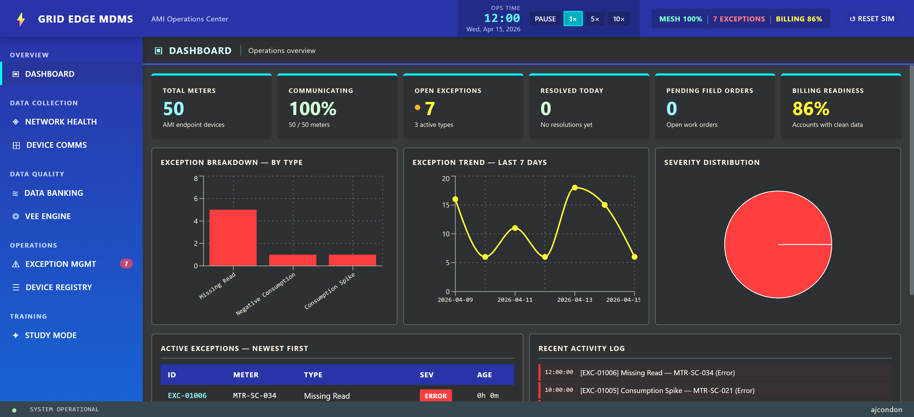
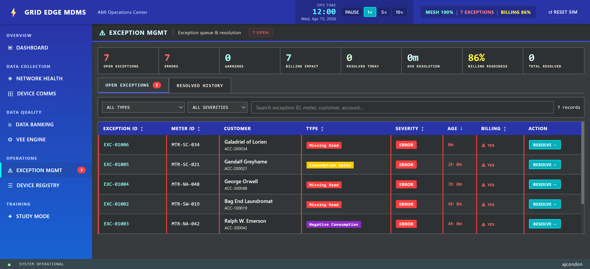

# AMI Analyst Workstation

An interactive, browser-based simulation of the systems an Advanced Metering Infrastructure (AMI) Exception Analyst uses day to day. Built as an educational tool for learning utility AMI operations and exception analysis workflows.

**[Live demo](https://ajcondondev.github.io/ami-analyst-workstation/)** (GitHub Pages, deployed automatically from `master`)

Everything runs client-side: there is no backend, no API keys, and no real data. All meter, customer, and grid data is generated in the browser.

## Screenshots





*Screenshots are from an earlier build. The live demo reflects the current design and includes additional modules.*

## What it simulates

AMI analysts work across multiple interconnected systems: they monitor RF mesh networks, manage meter communication failures, run VEE validation, resolve billing exceptions, and coordinate field service, all under billing cycle deadlines. This app models that workflow in a self-contained frontend simulation:

```
  Smart Meters (x50)
        |  RF Signal
        v
  Collector Nodes / DCUs (x5)
        |  WAN
        v
  Head-End System (HES) ----------> Event Log
        |
        v
  MDMS  (96 intervals / meter / day)
        |
        v
  VEE Pipeline -------------------> 7 Validation Rules
        |                                  |
        v                                  v
   Clean Data                       Exception Queue
        |                                  |
        v                           Resolution Workflow
   Billing <----------------------- (Retry / Estimate / Dispatch)
```

## Modules

| Module | What it does |
|---|---|
| **Dashboard** | Summary cards, exception trend chart, severity breakdown, activity log |
| **Network Health (RF Mesh)** | Animated SVG map of 50 meters and 5 collectors across 3 service areas, with live signal status |
| **Device Comms (Head-End)** | Meter communication table with on-demand reads, event log, sortable and filterable columns |
| **Data Banking (MDMS)** | 96-interval (15-minute) usage chart per meter, register read log, power quality event log |
| **VEE Engine** | 7 validation rules (missing intervals, spike check, sum check, etc.) with pass/fail per meter, plus estimation methods (linear, historical, similar meter) |
| **Exception Management** | Resolution workflow: review data, select action, add analyst note, audit trail |
| **Outage Analysis** | Grid topology tree (2 substations, 4 feeders, 12 transformers), transformer outage correlation |
| **Device Registry (CIS)** | Customer account lookup, 12-month billing history, service timeline, field order creation |
| **Billing & SLA** | Billing cycle countdown, exception aging color-coded by SLA tier, KPI strip |
| **Reports** | Daily exception summary, 7-day trend, billing accuracy chart, meter health scoring, CSV export |
| **Shift Handoff** | Persisted shift notes with an auto-fill template, compiled handoff report of open items |
| **Study Mode** | Exception type guide, AMI glossary, scored quiz, timed challenge walkthroughs |

## Exception types

The simulation generates 10 exception types an AMI analyst commonly encounters:

| Exception type | Description |
|---|---|
| **Missing Read** | Intervals not received within the collection window |
| **Consumption Spike** | Usage well above the meter's historical profile |
| **Zero Read on Active Account** | All intervals zero on a non-solar account |
| **Negative Consumption** | Negative intervals on a non-net-metering account |
| **Stale Data** | Register unchanged across 3+ read cycles |
| **Communication Failure** | Meter unreachable at the head-end |
| **Tamper Alert** | Enclosure open event |
| **CT Ratio Mismatch** | Programmed vs. field-detected ratio mismatch (commercial meters) |
| **Transformer Outage** | Multiple meters on the same transformer not communicating |
| **Voltage Excursion** | Repeated voltage sags or swells on a meter |

## Simulation engine

A background timer drives the simulation: every 15 seconds of real time advances the sim clock by 1 hour, multiplied by the selected speed.

| Behavior | Detail |
|---|---|
| Missing reads | Up to about 3% of meters per cycle |
| Stochastic events | Spikes, zero reads, stale data, and tamper alerts fire randomly |
| Cascading failures | Collectors can go offline, taking all downstream meters with them |
| RF signal drift | Random walk per meter |
| Power quality | Voltage sags, swells, and momentary/sustained outage events per meter |
| Exception ingestion | New exceptions enter the queue automatically |
| Speed controls | Pause, 1x, 5x, 10x |
| Persistence | Sim state is serialized to `localStorage` and survives page refresh, with a reset button |

## Data model

All data is generated client-side. There is no real meter data, no real customer information, and no external API calls. Customer names are fictional (mostly authors and Tolkien characters).

| Entity | Detail |
|---|---|
| **Meters** | 50 meters across 3 service areas: Springfield-West MA, Springfield-Central MA, Manchester NH |
| **Grid topology** | 2 substations, 4 feeders, 12 distribution transformers |
| **Collectors** | 5 DCUs with online/offline state |
| **Rate classes** | Residential, Commercial (with CT ratios), Solar (net metering) |
| **Load profiles** | Residential duck curve, commercial flat-peak, solar negative export during midday |
| **Seeded attributes** | Customer names, account numbers, addresses, firmware versions, install dates |

## Study Mode

A self-contained reference section that works without touching the simulation:

| Section | Contents |
|---|---|
| **Exception Guide** | All 10 exception types: what it is, why it matters, common causes, resolution guidance |
| **Glossary** | 36 AMI and utility terms defined in plain language |
| **Quiz** | 9 scenario-based questions with explanations; best score tracked in `localStorage` |
| **Challenges** | 3 timed simulation walkthroughs (triage and incident-response checklists) |

## Getting started

Requires Node.js 18 or later.

```bash
# Install dependencies
npm install

# Start the development server (http://localhost:5173)
npm run dev

# Production build
npm run build

# Preview the production build
npm run preview
```

No environment variables or backend services are needed.

## Tech stack

| Layer | Technology |
|---|---|
| **Framework** | React 19 + Vite 8 |
| **Charts** | Recharts |
| **Styling** | Custom CSS, system fonts, no UI framework |
| **Persistence** | `localStorage` |
| **Deployment** | GitHub Actions workflow publishing the Vite build to GitHub Pages |

## Project structure

```
src/
├── components/
│   ├── dashboard/      # Operations dashboard
│   ├── rfmesh/         # RF mesh network view
│   ├── headend/        # Head-end system (device comms)
│   ├── mdms/           # Interval data + power quality viewer
│   ├── vee/            # VEE engine
│   ├── exceptions/     # Exception queue + resolution workflow
│   ├── outage/         # Grid topology + outage analysis
│   ├── cis/            # Customer information system
│   ├── billing/        # Billing cycle + SLA dashboard
│   ├── reports/        # Reports + CSV export
│   ├── handoff/        # Shift handoff notes + report
│   ├── study/          # Study mode (guide, glossary, quiz, challenges)
│   └── shared/         # StatusBadge, SimClock
├── data/
│   ├── meters.js       # 50 meters, collectors, service areas, load profiles
│   └── grid.js         # Substations, feeders, transformers
├── engine/
│   └── simulation.js   # Sim engine: clock, exception generation, state
├── hooks/
│   └── useSimulation.js # React hook: tick loop, derived stats, actions
└── styles/             # Global + per-module CSS
```

## Notes

- This is an educational simulation, not production software. The HES, MDMS, VEE, and CIS behaviors are simplified models of the real systems.
- All customers, meters, addresses, and readings are fictional and generated in the browser.
- Not affiliated with any utility or AMI vendor.

## Purpose

This project demonstrates working knowledge of:

- How AMI infrastructure is organized (meters, RF mesh, collectors, HES, MDMS, billing)
- What an exception analyst's daily workflow looks like
- The VEE pipeline: what each rule checks and why it matters for billing accuracy
- Triage decision-making for common exception types: when to retry comms, estimate, edit, escalate, or dispatch a field technician
- Outage correlation: distinguishing single-meter failures from transformer- or collector-level events
- CT ratio math and its billing impact on commercial accounts
- The difference between data quality issues and physical meter failures
